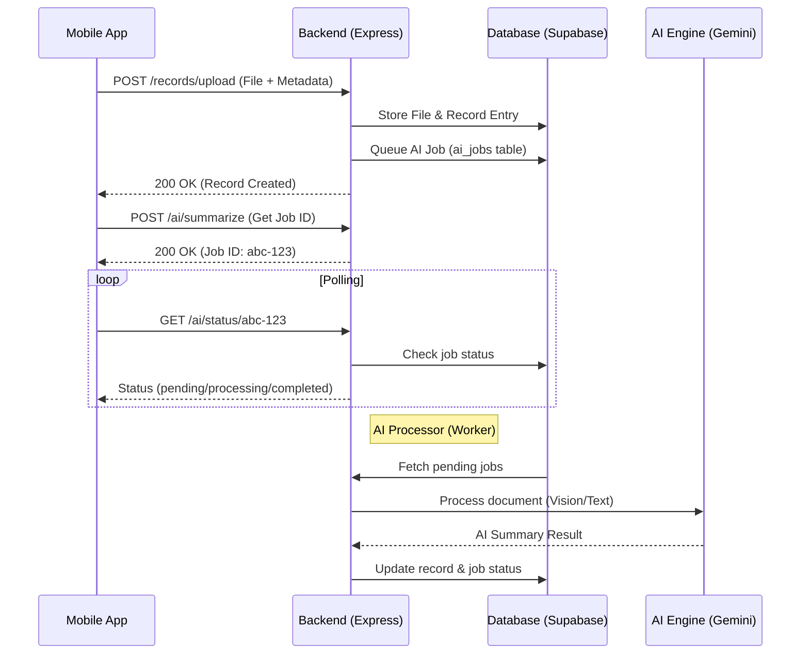

# Medora Uploading and AI Workflow

This document explains the end-to-end process of how medical documents are uploaded, processed by AI, and how the results are displayed in the Medora application.

---

## 1. High-Level Overview

The Medora app uses a hybrid approach for document processing. It combines immediate storage in Supabase with an asynchronous AI processing pipeline powered by Google Gemini.

---

## 2. Client-Side Workflow (Upload Screen)

The logic resides primarily in `app/upload/index.tsx`.

### Step 1: File Selection
The user selects a PDF or image file using `expo-document-picker`. The app validates the file type and size.

### Step 2: Record Creation (`POST /records/upload`)
- The file is sent to the backend.
- The backend stores the file in **Supabase Storage** (bucket: `records`).
- A record entry is created in the `records` table.
- **Crucial**: The backend automatically adds a row to the `ai_jobs` table for this record to ensure it is eventually processed even if the client disconnects.

### Step 3: AI Trigger (`POST /ai/summarize`)
- To provide real-time feedback, the app explicitly calls the `/ai/summarize` endpoint.
- This returns a `jobId`, which allows the app to track the specific processing status of that file.

### Step 4: Status Polling
- The app enters a polling loop (every 3 seconds).
- It calls `GET /ai/status/:jobId`.
- The UI updates to reflect the current state: `Queued` → `Extracting medical data...` → `AI analysis complete!`.
- If the file was uploaded before (same hash), the backend returns `fromCache: true` and the results immediately.

---

## 3. Backend Processing Flow

The backend handles the heavy lifting through a worker-based architecture.

### The AI Job Queue
1. **Queueing**: When `/records/upload` is hit, a job is queued in the `ai_jobs` table.
2. **Worker**: A background processor (`aiProcessor.js`) polls the `ai_jobs` table every 5 seconds for `pending` tasks.
3. **Processing**: For each task, the worker:
   - Fetches the document (as buffer or base64).
   - Uses **Gemini 2.5 Flash** to analyze the document.
   - If it's a PDF, it uses `pdf-parse` for text extraction as a fallback.
   - If it's an image, it uses **Tesseract OCR** as a fallback.
4. **Completion**: Once processed, the worker updates the `ai_summary` column in the `records` table and marks the job as `completed`.

### Multi-Stage AI Pipeline
The system attempts to extract data in this priority order:
1. **Gemini Vision**: High-quality analysis of images/PDFs directly.
2. **Text Extraction + Gemini Text**: Extracts text first, then asks Gemini to summarize the text.
3. **OpenRouter Fallback**: If Gemini fails, it attempts to use alternate models.
4. **Safe JSON Fallback**: Ensures the system never "crashes" by providing a structured generic response if all else fails.

---

## 4. Longitudinal Insights (Summarizing Summaries)

Medora doesn't just analyze individual files. On the Home screen, it performs a **Longitudinal Health Analysis**:

1. **Aggregation**: The app fetches all records with existing `ai_summary` fields.
2. **Batch Processing**: It sends these summaries to `/ai/summarize-summaries`.
3. **Trend Analysis**: Gemini reviews the collection of summaries to identify health trends, improvements, or concerns over time.
4. **Display**: The result is shown in the "Smart Insights" section on the home screen.

---

## 5. Summary of Key Endpoints

| Endpoint | Method | Purpose |
| :--- | :--- | :--- |
| `/records/upload` | `POST` | Primary upload to storage and DB |
| `/ai/summarize` | `POST` | Get a tracking `jobId` for a file |
| `/ai/status/:id` | `GET` | Poll for AI processing status |
| `/ai/summarize-summaries` | `POST` | Generate longitudinal insights |

---

> [!TIP]
> **Performance Optimization**: The system uses SHA-256 hashing. If the same file is uploaded multiple times (even by different users), the AI analysis is performed once and cached for future requests.
